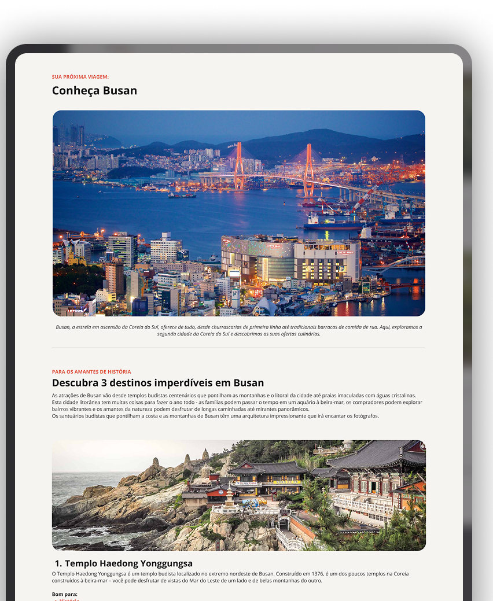

# Local Turístico
## 🚀 Tecnologias

Esse projeto foi desenvolvido com as seguintes tecnologias:
- HTML
- CSS

## 💻 Projeto
Desafio prático realizado na formação de Full-Stack da Rocketseat.
Neste desafio, o foco principal foi apenas no HTML e CSS.

## 📺 Layout
